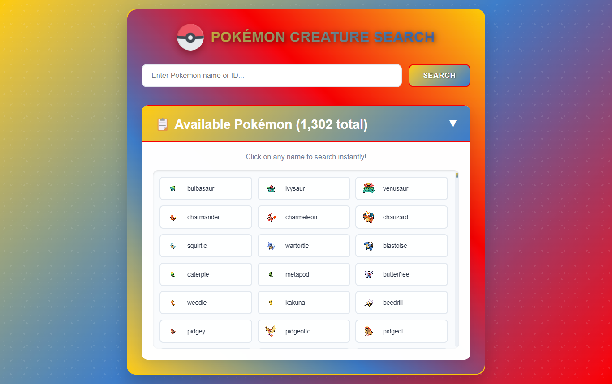

# 🎮 Pokémon Creature Search App


A comprehensive Pokémon search application that fetches data from the PokéAPI. Search for any of the 1,302 available Pokémon by name or ID to view detailed stats, abilities, types, and images with a beautiful, responsive interface.

## 📸 Screenshots

<div align="center">
  
  <p><em>Interactive Pokémon search with detailed stats and beautiful UI design</em></p>
</div>

## ✨ Live Demo

🌐 **[View Pokémon Creature Search App](https://pokemon-creature-search-app-shibam.vercel.app)**

## 🚀 Key Features

- **🔍 Smart Search**: Search by Pokémon name or ID from 1,302+ available Pokémon
- **📊 Detailed Stats**: Complete battle stats (HP, Attack, Defense, Sp. Attack, Sp. Defense, Speed)
- **🎯 Abilities Display**: View all Pokémon abilities with clean presentation
- **🔥 Type System**: Visual type badges with appropriate colors
- **🖼️ High-Quality Images**: Official Pokémon artwork and sprites
- **📱 Responsive Design**: Perfect experience across all devices
- **📋 Complete Pokédex**: Accordion view of all available Pokémon
- **⚡ Fast API Integration**: Real-time data from PokéAPI
- **✨ Smooth Animations**: Elegant transitions and loading states

## 🎨 Design Features

### Visual Elements
- **Pokéball Logo**: Authentic Pokémon branding with custom Pokéball icon
- **Type Badges**: Color-coded type system matching official Pokémon colors
- **Stat Visualization**: Clean stat display with proper labeling
- **Card Layout**: Modern card-based design for information display

### User Experience
- **Instant Search**: Real-time search with Enter key support
- **Error Handling**: Graceful handling of invalid searches
- **Loading States**: Visual feedback during API calls
- **Close Functionality**: Easy-to-use close button for details view

## 📱 Core Functionality

1. **🔍 Pokémon Search** - Search by name (e.g., "Pikachu") or ID (e.g., "25")
2. **📊 Stats Display** - Complete battle statistics with proper formatting
3. **🎯 Abilities** - All Pokémon abilities displayed clearly
4. **🔥 Type System** - Visual type badges (Fire, Water, Grass, etc.)
5. **📋 Pokédex Browser** - Expandable list of all 1,302 Pokémon
6. **🖼️ Image Gallery** - High-quality official Pokémon artwork
7. **📱 Responsive Layout** - Optimized for mobile, tablet, and desktop

## 🛠️ Tech Stack

- **⚡ Frontend**: HTML5, CSS3, Vanilla JavaScript
- **🌐 API**: PokéAPI (pokeapi-proxy.freecodecamp.rocks)
- **🎨 Styling**: CSS Grid, Flexbox, Custom animations
- **📱 Responsive**: Mobile-first responsive design
- **🖼️ Images**: Official Pokémon artwork and sprites
- **🔄 Async**: Modern async/await for API calls

## 🚀 Getting Started

### Prerequisites

- Modern web browser with JavaScript enabled
- Internet connection for API calls
- No additional dependencies required

### Installation

1. **Clone the repository**
   ```bash
   git clone https://github.com/your-username/pokemon-creature-search-app.git
   cd pokémon-creature-search-app-shibam
   ```

2. **Open the application**
   ```bash
   # Option 1: Open directly in browser
   open index.html
   
   # Option 2: Use a local server (recommended)
   python -m http.server 8000
   # or
   npx serve .
   ```

3. **Start searching Pokémon**
   - Enter a Pokémon name or ID in the search box
   - Click "Search" or press Enter
   - Explore the detailed information and stats

## 📁 Project Structure

```
pokémon-creature-search-app-shibam/
├── 📄 index.html              # Main HTML structure
├── 🎨 styles.css              # Styling and responsive design
├── ⚡ script.js               # API integration and app logic
├── 🎮 pokeball.png            # Pokéball logo asset
├── 📸 screenshot/             # Application screenshots
├── 📖 README.md               # Project documentation
├── 📜 LICENSE                 # MIT License
└── 🚫 .gitignore              # Git ignore rules
```

## 🛠️ Technologies Used

<table>
<tr>
<td align="center"><br><b>HTML5</b></td>
<td align="center"><br><b>CSS3</b></td>
<td align="center"><br><b>JavaScript</b></td>
<td align="center"><br><b>PokéAPI</b></td>
<td align="center"><br><b>Git</b></td>
</tr>
</table>

## 🎯 API Integration Features

### PokéAPI Integration
- **Base URL**: `https://pokeapi-proxy.freecodecamp.rocks/api/pokemon`
- **Search Methods**: By name (case-insensitive) or ID number
- **Data Retrieved**: Complete Pokémon information including stats, abilities, types
- **Error Handling**: Graceful handling of invalid searches and network errors

### Supported Pokémon Data
- **Basic Info**: Name, ID, Height, Weight, Base Experience, Order
- **Battle Stats**: HP, Attack, Defense, Special Attack, Special Defense, Speed
- **Abilities**: All available abilities for each Pokémon
- **Types**: Primary and secondary types with visual badges
- **Images**: High-quality official artwork

## 🧮 Usage Examples

### Example 1: Search by Name
- **Input**: "Pikachu"
- **Result**: Displays Pikachu (#25) with all stats and Electric type
- **Features**: Shows abilities like "Static" and "Lightning Rod"

### Example 2: Search by ID
- **Input**: "150"
- **Result**: Displays Mewtwo with Psychic type and legendary stats
- **Features**: High base stats and powerful abilities

### Example 3: Browse All Pokémon
- **Action**: Click on accordion to expand Pokédex
- **Result**: Shows all 1,302 available Pokémon in a grid
- **Features**: Click any name to instantly search

## 🎮 Pokémon Type System

The app supports all 18 Pokémon types with authentic colors:
- **🔥 Fire** - Red/Orange theme
- **💧 Water** - Blue theme  
- **🌿 Grass** - Green theme
- **⚡ Electric** - Yellow theme
- **🧊 Ice** - Light blue theme
- **🥊 Fighting** - Red/Brown theme
- **☠️ Poison** - Purple theme
- **🌍 Ground** - Brown theme
- **🕊️ Flying** - Light blue/white theme
- **🧠 Psychic** - Pink theme
- **🐛 Bug** - Green theme
- **🗿 Rock** - Brown/gray theme
- **👻 Ghost** - Purple theme
- **🐉 Dragon** - Blue/purple theme
- **🌑 Dark** - Black theme
- **⚔️ Steel** - Gray theme
- **🧚 Fairy** - Pink theme
- **🔘 Normal** - Beige theme

## 🌐 Deployment

### 🚀 Quick Deploy Options

1. **GitHub Pages**
   - Push to GitHub repository
   - Enable GitHub Pages in repository settings
   - Access via `https://username.github.io/repository-name`

2. **Netlify**
   - Drag and drop project folder to Netlify
   - Get instant live URL with HTTPS

3. **Vercel**
   - Import GitHub repository
   - Zero-configuration deployment

## 📊 Performance Features

- **Efficient API Calls**: Optimized requests to PokéAPI
- **Image Optimization**: Lazy loading for Pokémon images
- **Caching Strategy**: Browser caching for repeated searches
- **Responsive Images**: Adaptive images for different screen sizes
- **Fast Rendering**: Optimized DOM manipulation

## 🔧 Available Scripts

```bash
# Development
python -m http.server 8000    # Start local development server
npx serve .                   # Alternative local server

# Testing
# Search for different Pokémon by name and ID
# Test error cases with invalid inputs
```

## 🧪 Testing Examples

Try these searches:
- **By Name**: "Pikachu", "Charizard", "Mewtwo", "Rayquaza"
- **By ID**: "1" (Bulbasaur), "25" (Pikachu), "150" (Mewtwo)
- **Edge Cases**: "999999" (invalid), "NotAPokemon" (invalid)
- **Case Insensitive**: "PIKACHU", "pikachu", "PiKaChU"

## ♿ Accessibility Features

- **Semantic HTML**: Proper heading structure and form elements
- **Keyboard Navigation**: Full keyboard support with Enter key
- **Screen Reader Support**: Alt text for images and ARIA labels
- **High Contrast**: Clear visual distinction between elements
- **Focus Management**: Visible focus indicators

## 📝 License

This project is open source and available under the [MIT License](LICENSE).

## 🤝 Contributing

Contributions, issues, and feature requests are welcome! Feel free to check the [issues page](https://github.com/your-username/pokemon-creature-search-app/issues).

## 📞 Contact

**Shibam Banerjee**
- Email: Connect-With-Shibam@outlook.com
- Phone: +91 62902-18960
- LinkedIn: [linkedin.com/in/shibam-webdev](https://linkedin.com/in/shibam-webdev)
- GitHub: [github.com/Shibam-Code-Pro](https://github.com/Shibam-Code-Pro)

## 🙏 Acknowledgments

- [PokéAPI](https://pokeapi.co/) for providing comprehensive Pokémon data
- [freeCodeCamp](https://www.freecodecamp.org/) for the API proxy and project inspiration
- [The Pokémon Company](https://www.pokemon.com/) for the amazing Pokémon universe
- [MDN Web Docs](https://developer.mozilla.org/) for web development resources

---

⭐ **If you found this project helpful, please give it a star!** ⭐
